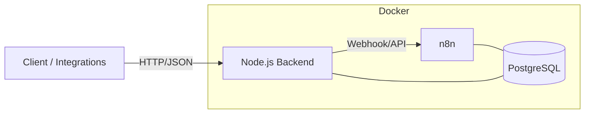

# Process Management System — Node.js Backend + n8n

> Project is in active development.


---

## Table of Contents

- [Overview](#overview)
- [Architecture](#architecture)
- [Project Structure](#project-structure)
- [Quick Start](#quick-start)
- [Configuration](#configuration)
    - [Environment Variables for `nodeapp`](#environment-variables-for-nodeapp)
    - [Environment Variables for `n8n`/PostgreSQL](#environment-variables-for-n8npostgresql)
- [Running the Project](#running-the-project)
    - [Run the Backend](#run-the-backend)
    - [Run n8n + PostgreSQL (Docker)](#run-n8n--postgresql-docker)
    - [Deploy Custom Nodes to n8n](#deploy-custom-nodes-to-n8n)
- [Backend API (Examples)](#backend-api-examples)
- [Working with Custom Nodes](#working-with-custom-nodes)
- [Logging & Diagnostics](#logging--diagnostics)
- [License](#license)

---

## Overview

This project comprises two main components:

1. **Node.js Backend (**`nodeapp`**)** — A REST/HTTP service that:
    - Handles requests from external clients or systems.
    - Communicates with n8n via HTTP API or webhooks.
    - Stores events and results in a PostgreSQL database.
2. **n8n + PostgreSQL** — A workflow automation platform with data persistence in PostgreSQL, deployed via Docker. Includes a `deploy_node.sh` script for uploading and updating custom n8n nodes.

---

## Architecture



---

## Project Structure

```
project-root/
│
├─ nodeapp/                     # Node.js backend
│  ├─ bin/www                   # Starts HTTP server
│  ├─ config/config.example.js  # Example config
│  ├─ enums/                    # App enums
│  ├─ libs/                     # App libs
│  ├─ models/                   # DB models
│  ├─ routes/                   # App routes
│  ├─ utils/                    # App utils
│  ├─ workflows/                # N8N workflow templates
│  ├─ app.js/                   # App main script
│  ├─ server.js/                # App server start
│  ├─ package.json              # Dependencies and scripts
│  ├─ docker-compose.yml        # Node.js configuration
│  └─ ...
│
├─ n8n/                     # n8n environment + custom nodes
│  ├─ docker-compose.yml    # n8n + PostgreSQL configuration
│  ├─ nodes/                # Custom n8n nodes
│  └─ deploy_node.sh        # Script to deploy custom nodes
│
└─ README.md
```

---

## Quick Start

1. **Prepare environment variables**:

   ```bash
   cp nodeapp/.env.example nodeapp/.env
   cp n8n/.env.example n8n/.env
   ```

2. **Start n8n + PostgreSQL (Docker)**:

   ```bash
   cd n8n
   docker-compose up -d
   ```

3. **Run the backend Node.js**:

   ```bash
   cd ../nodeapp
   docker-compose up -d
   ```

- **n8n default URL**: `http://localhost:5678`
- **Backend default URL**: `http://localhost:3000`

---

## Configuration

### Environment Variables for `nodeapp`

Create `nodeapp/.env`:

```
#  Can be set from the list: dev, test, prod.
NODE_ENV=

DB_PROVIDER=

LOG_LEVEL=

# FORCE_SYNC_DB should be false for prod env
FORCE_SYNC_DB=
NO_FORCE_SYNC_DB=

TUKE_SSO2_ACCESS_TOKEN=
TUKE_USER_GROUPS=STUDENT,DOCTORAL,PROFESSOR,STAFF

N8N_API_KEY=
N8N_CONTAINER_NAME=
N8N_BASE_URL=
N8N_AUTH_USER=
N8N_AUTH_PASSWORD=
N8N_API_USER_EMAIL=
N8N_API_USER_PASSWORD=
```

### Environment Variables for `n8n`/PostgreSQL

Set in `n8n/.env`:

```
# ENV VARIABLES
IS_PROD=false

# DB
POSTGRES_USER=postgres
POSTGRES_PASSWORD=postgres
POSTGRES_DB=n8n

# n8n
N8N_HOST=localhost
N8N_PORT=5678
N8N_BASIC_AUTH_USER=admin
N8N_BASIC_AUTH_PASSWORD=adminpassword
N8N_ENCRYPTION_KEY=supersecretkey
N8N_EDITOR_BASE_URL=http://localhost:5678

```

---

## Running the Project

### Run the Backend

```bash
cd nodeapp
docker-compose up -d
```

### Run n8n + PostgreSQL (Docker)

```bash
cd n8n
docker-compose up -d
```

n8n will be accessible at `http://localhost:5678`.

### Deploy Custom Nodes to n8n

```bash
cd n8n
./deploy_node.sh
```

This script uploads custom nodes to the n8n container and restarts it.

---

## Backend API (Examples)

// TO DO

---

## Working with Custom Nodes

Custom nodes are stored in `n8n/nodes/`. To add or update nodes:

1. Place node files in `n8n/nodes/customNode`.
2. Run `./deploy_node.sh` to upload and apply changes.
3. Verify nodes in the n8n UI under the nodes panel.

---

## Logging & Diagnostics

- **Backend logs**: Written to console.
- **n8n logs**: Available via `docker logs n8n`.

---

## License

MIT License — you are free to use, modify, and distribute this project.