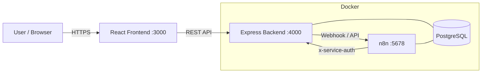

# Process Management System — Node.js Backend + n8n

> Project is in active development.


---

## Table of Contents

- [Overview](#overview)
- [Architecture](#architecture)
- [Project Structure](#project-structure)
- [Quick Start](#quick-start)
- [Configuration](#configuration)
    - [Environment Variables — `nodeapp`](#environment-variables--nodeapp)
    - [Environment Variables — `n8n` / PostgreSQL](#environment-variables--n8n--postgresql)
- [Running the Project](#running-the-project)
- [Components](#components)
    - [nodeapp — Express Backend](#nodeapp--express-backend)
    - [reactapp — React Frontend](#reactapp--react-frontend)
    - [n8n — Workflow Automation](#n8n--workflow-automation)
- [Testing](#testing)
- [License](#license)

---

## Overview

A university information system that replaces paper-based administrative processes at TUKE. Students and staff fill out digital forms (e.g. individual study plans, scholarship requests), which are routed through configurable approval workflows.

The system consists of three components:

| Component | Description | Port |
|-----------|-------------|------|
| `nodeapp` | Express.js REST API backend | 4000 (HTTPS) |
| `reactapp` | React 19 frontend | 3000 |
| `n8n` | Workflow automation with custom nodes | 5678 |

All components share a PostgreSQL database.

---

## Architecture


```mermaid
flowchart LR
    User[User / Browser] -- HTTPS --> React[React Frontend :3000]
    React -- REST API --> NodeApp[Express Backend :4000]
    NodeApp -- Webhook / API --> N8N[n8n :5678]
    N8N -- x-service-auth --> NodeApp
    NodeApp --- PG[(PostgreSQL)]
    N8N --- PG

    subgraph Docker
      NodeApp
      N8N
      PG
    end
```

**Authentication flow:** TUKE KPI SSO (OAuth2/OpenID Connect) → session cookie + CSRF token stored in DB.

**Service-to-service auth:** n8n calls backend using `x-service-auth` header with a shared `INTERNAL_SECRET`.

---

## Project Structure

```
electronic-processes/
│
├── nodeapp/                        # Express.js backend (Node.js)
│   ├── routes/                     # REST API routes
│   │   ├── auth.js                 # OAuth2 SSO login/logout
│   │   ├── users.js                # User management
│   │   ├── usersGroups.js          # User groups (STUDENT, PROFESSOR, STAFF, ...)
│   │   ├── forms.js                # Form templates CRUD
│   │   ├── formsInstances.js       # Form submissions and lifecycle
│   │   ├── formConditions.js       # Conditional form routing
│   │   ├── processes.js            # Process definitions
│   │   ├── processesInstances.js   # Running process instances
│   │   ├── orgUnits.js             # Organisational units tree
│   │   ├── orgRoles.js             # Roles within org units
│   │   ├── userOrgRoles.js         # User ↔ role assignments
│   │   ├── userWorkplaces.js       # User workplace assignments
│   │   ├── semesters.js            # Semester management
│   │   └── n8n.js                  # n8n webhook integration
│   ├── models/
│   │   ├── users/                  # Users, Sessions, Groups, OrgUnits, OrgRoles, Semesters
│   │   └── processes/              # Forms, FormsInstances, Processes, ProcessesInstances, FormConditions
│   ├── utils/
│   │   ├── AuthWrapper.js          # Session + internal secret middleware
│   │   ├── ResponseBuilder.js      # Unified API response format
│   │   ├── Logger.js               # Log-level-aware logger with sensitive data masking
│   │   ├── RoutesUtils.js          # Query param helpers (eager, length, offset, lan)
│   │   ├── UserUtils.js            # Session expiry, role/org auto-assignment
│   │   └── UserSessionCleanupUtil.js # Cron job: removes expired sessions nightly
│   ├── services/
│   │   └── n8nService.js           # n8n API client
│   ├── seeds/
│   │   └── orgStructureSeed.js     # Example org structure seed
│   ├── tests/
│   │   ├── setup.js                # Global jest setup (mocks for globals)
│   │   ├── unit/                   # Unit tests (ResponseBuilder, Logger, UserUtils, RoutesUtils)
│   │   └── integration/            # Integration tests with supertest (formConditions, authWrapper)
│   ├── workflows/                  # n8n workflow JSON templates
│   ├── app.js                      # Express app setup
│   ├── server.js                   # HTTPS server entry point
│   └── package.json
│
├── reactapp/                       # React 19 frontend
│   ├── src/
│   │   ├── pages/
│   │   │   ├── LandingPage.js      # App entry / login
│   │   │   ├── FormsPage.js        # Available, awaiting, and filled forms
│   │   │   ├── ProfilePage.js      # User profile
│   │   │   └── AdminPage.js        # Admin panel (STAFF only)
│   │   ├── components/             # Shared UI components (Header, Forms, GroupSelector, ...)
│   │   ├── api/                    # Axios API service modules
│   │   ├── contexts/               # React context providers
│   │   ├── hooks/                  # Custom React hooks
│   │   ├── i18n/                   # Translations (EN / SK)
│   │   └── utils/                  # Frontend utilities
│   └── package.json
│
├── n8n/                            # n8n custom nodes package (TypeScript)
│   ├── nodes/
│   │   ├── DynamicForm/            # Renders form fields, supports group/individual/role assignees
│   │   ├── FormStartNode/          # Starts a process workflow
│   │   ├── FormEndNode/            # Ends a process workflow
│   │   ├── FormInstanceStartNode/  # Starts a specific form instance
│   │   ├── FormInstanceResumeNode/ # Resumes a paused form instance
│   │   ├── ConditionalFormRouter/  # Routes to next form based on field conditions
│   │   ├── ProcessActionNode/      # Executes an administrative action in a process
│   │   └── ProcessActionEndNode/   # Ends a process action node
│   ├── deploy_node.sh              # Uploads compiled nodes to n8n container and restarts it
│   └── package.json
│
└── README.md
```

---

## Quick Start

1. **Copy environment files:**

   ```bash
   cp nodeapp/.env.example nodeapp/.env
   cp n8n/.env.example n8n/.env
   ```

2. **Start PostgreSQL + n8n (Docker):**

   ```bash
   cd n8n
   docker-compose up -d
   ```

3. **Start the backend:**

   ```bash
   cd nodeapp
   docker-compose up -d
   ```

4. **Start the frontend (dev):**

   ```bash
   cd reactapp
   npm install
   npm start
   ```

- React frontend: `http://localhost:3000`
- Express backend: `https://localhost:4000`
- n8n editor: `http://localhost:5678`

---

## Configuration

### Environment Variables — `nodeapp`

Create `nodeapp/.env`:

```env
# dev | test | prod
NODE_ENV=dev

LOG_LEVEL=info

# Set true to drop and recreate tables on startup (never in prod)
FORCE_SYNC_DB=false
# Comma-separated DB names to skip force sync (e.g. n8n)
NO_FORCE_SYNC_DB=n8n

# Enable session-based auth middleware
API_AUTH=true

# Shared secret for n8n → backend service calls
INTERNAL_SECRET=

# TUKE SSO OAuth2
TUKE_SSO2_CLIENT_ID=
TUKE_SSO2_CLIENT_SECRET=
TUKE_SSO2_REDIRECT_URI=

# Default user groups to seed on startup
TUKE_USER_GROUPS=STUDENT,DOCTORAL,PROFESSOR,STAFF

# n8n connection
N8N_API_KEY=
N8N_BASE_URL=http://localhost:5678
N8N_AUTH_USER=
N8N_AUTH_PASSWORD=
```

### Environment Variables — `n8n` / PostgreSQL

Create `n8n/.env`:

```env
IS_PROD=false

# PostgreSQL
POSTGRES_USER=postgres
POSTGRES_PASSWORD=postgres
POSTGRES_DB=n8n

# n8n
N8N_HOST=localhost
N8N_PORT=5678
N8N_BASIC_AUTH_USER=admin
N8N_BASIC_AUTH_PASSWORD=adminpassword
N8N_ENCRYPTION_KEY=supersecretkey
N8N_EDITOR_BASE_URL=http://localhost:5678
```

---

## Running the Project

### Backend

```bash
cd nodeapp
npm start                  # production
npx nodemon server.js      # development (auto-restart)
docker-compose up -d       # via Docker
```

### n8n + PostgreSQL

```bash
cd n8n
docker-compose up -d
```

### Deploy Custom n8n Nodes

```bash
cd n8n
npm run build              # compile TypeScript → dist/
./deploy_node.sh           # upload to running n8n container and restart
```

### Frontend

```bash
cd reactapp
npm start                  # dev server on :3000
npm run build              # production build
```

---

## Components

### nodeapp — Express Backend

- **REST API** with routes for users, forms, processes, org structure, semesters
- **Role system**: organisational units (tree structure) + roles within units; users are auto-assigned roles based on email patterns
- **Semester management**: transition students between org units when a new semester is activated; copy professor assignments
- **Form conditions**: conditional routing between forms within a process based on field values
- **Session auth**: cookie-based sessions with CSRF tokens; nightly cleanup cron job
- **Workflow generation**: process workflow JSON is generated programmatically and inserted into the n8n database directly

### reactapp — React Frontend

- **FormsPage**: three tabs — available forms to fill, forms awaiting your approval, previously filled forms
- **AdminPage** (STAFF only): manage organisational unit tree, assign roles to units, assign users to roles and workplaces, manage semesters and process activation
- **i18n**: English and Slovak via `react-i18next`
- **SSO login**: redirects to TUKE KPI OAuth2 provider

### n8n — Workflow Automation

Custom nodes available in the n8n editor:

| Node | Description |
|------|-------------|
| `DynamicForm` | Renders form to an assignee; supports `group`, `individual_emails`, `shared_emails`, and `role` assignee types |
| `FormStartNode` | Entry point — starts a new process instance |
| `FormEndNode` | Marks the process as completed |
| `FormInstanceStartNode` | Activates a specific form instance |
| `FormInstanceResumeNode` | Resumes a form instance after external action |
| `ConditionalFormRouter` | Routes to different next forms based on a field value condition |
| `ProcessActionNode` | Triggers an administrative action within a process |
| `ProcessActionEndNode` | Ends a process action step |

---

## Testing

Tests are located in `nodeapp/tests/` and run with Jest.

```bash
cd nodeapp
npm test
```

### Unit tests (`tests/unit/`)

| File | What is tested |
|------|----------------|
| `ResponseBuilder.test.js` | `success()`, `error()`, `fail()` responses |
| `Logger.test.js` | Log level filtering, base64 masking, sensitive field sanitization |
| `UserUtils.test.js` | `isSessionExpired()` including boundary cases |
| `RoutesUtils.test.js` | `getDefaultRequestParams()` — eager, length, offset, language |

### Integration tests (`tests/integration/`)

| File | What is tested |
|------|----------------|
| `formConditions.test.js` | POST create/update condition, GET by processId, 400/500 error handling |
| `authWrapper.test.js` | Internal secret auth, excluded routes, session validation, expired sessions |

---

## License

MIT License — you are free to use, modify, and distribute this project.

